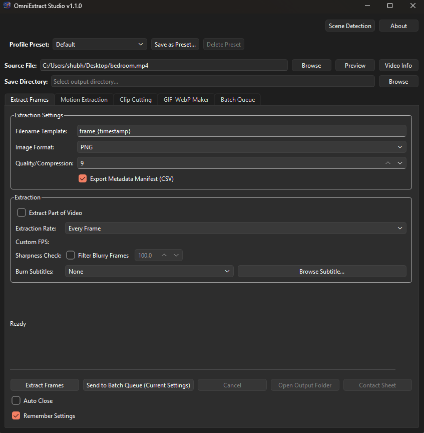
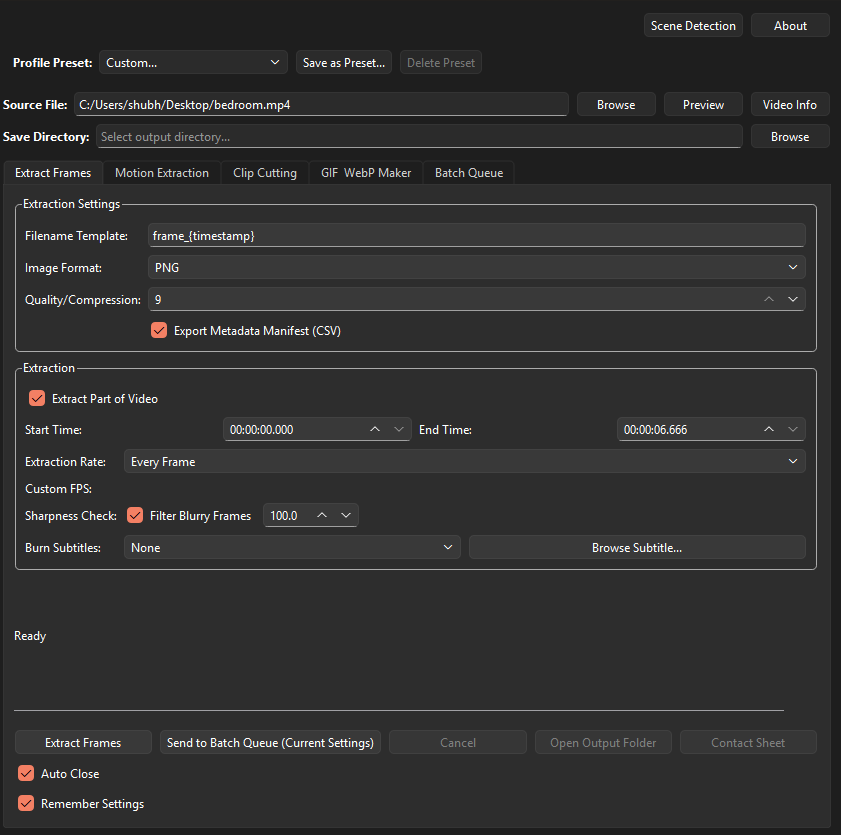
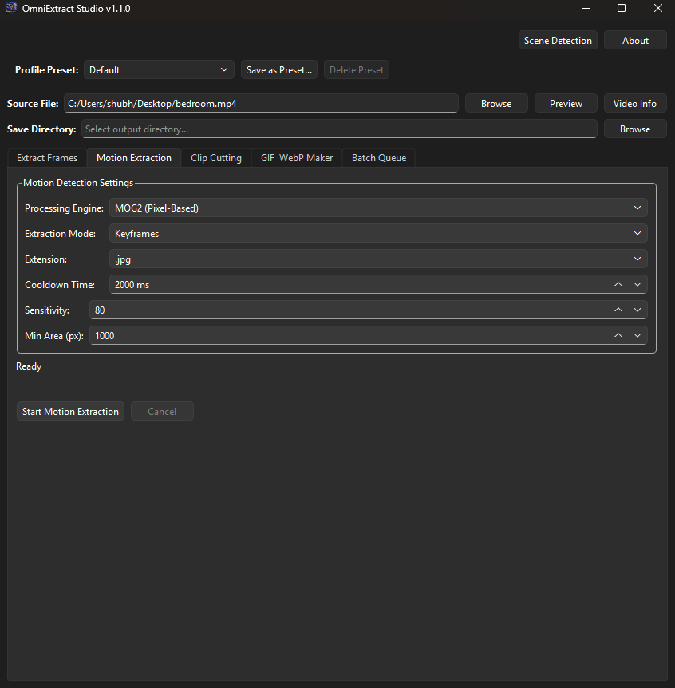
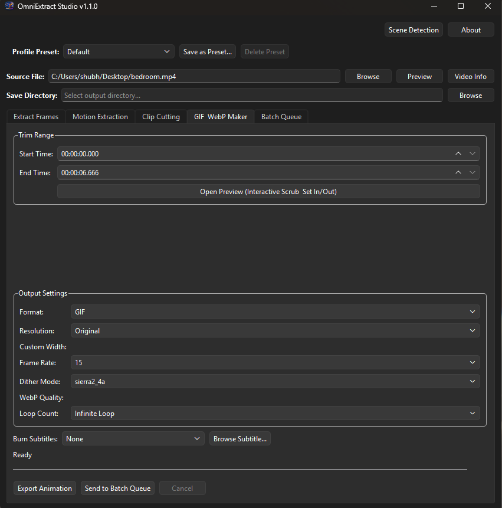
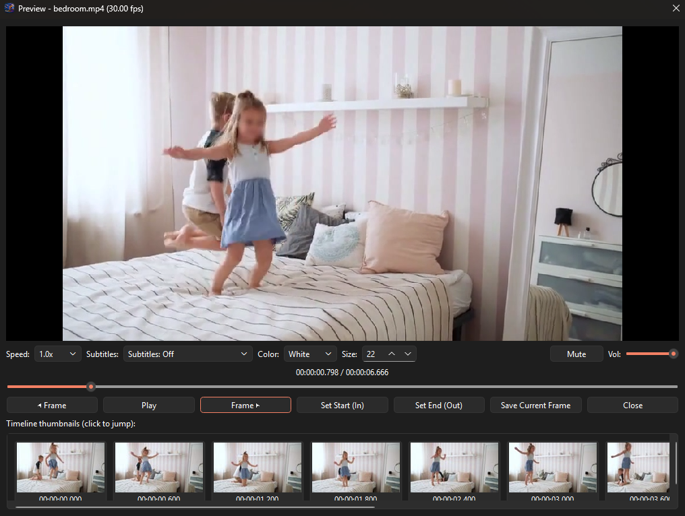
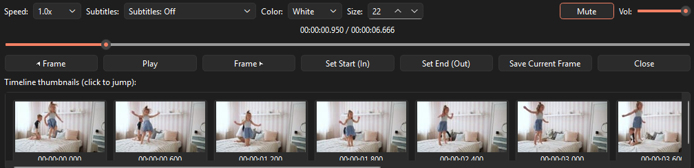

<div align="center">
  
  <h1>OmniExtract Studio v1.1.0</h1>
  <p><b>An all-in-one desktop application designed for high-precision video processing, frame extraction, intelligent motion tracking, and more.</b></p>
  
  [](https://github.com/IAmThroot/OmniExtractorStudio/releases)
  [](LICENSE)
  
  <br>

  <a href="https://github.com/IAmThroot/OmniExtractorStudio/releases/latest">
    
  </a>
  <a href="https://github.com/IAmThroot/OmniExtractorStudio/releases/latest">
    
  </a>

  <br><br>
  
  
</div>

---

---

## 📥 Installation Guide

### Option 1: Pre-built Binaries (No Python Setup Needed)
1. Head over to the **[Releases](https://github.com/IAmThroot/OmniExtractorStudio/releases)** page.
2. **Windows (Portable `.zip`)**:
   - Download and extract `OmniExtract-Windows.zip`.
   - Run `OmniExtract.exe` from the extracted folder.
   - *Requirement*: Ensure FFmpeg is installed and accessible in your Windows system PATH (see below).
3. **Linux (`.AppImage`)**:
   - Download `OmniExtract-x86_64.AppImage`.
   - Make it executable:
     ```bash
     chmod +x OmniExtract-x86_64.AppImage
     ./OmniExtract-x86_64.AppImage
     ```

### Option 2: Running from Source

#### 1. Prerequisites: FFmpeg Installation
OmniExtract Studio uses FFmpeg for high-speed multiplexing, stream copying, audio/video encoding, and subtitle ripping.

- **Windows**:
  - Download a release build from [gyan.dev](https://www.gyan.dev/ffmpeg/builds/) or install via winget / scoop:
    ```powershell
    winget install Gyan.FFmpeg
    ```
  - Verify in PowerShell or Command Prompt:
    ```powershell
    ffmpeg -version
    ```
- **Linux (Ubuntu / Debian / Mint)**:
  ```bash
  sudo apt update && sudo apt install ffmpeg
  ```
- **Linux (Arch / Manjaro)**:
  ```bash
  sudo pacman -S ffmpeg
  ```

#### 2. Clone Repository & Setup Environment
```bash
git clone https://github.com/IAmThroot/OmniExtractorStudio.git
cd OmniExtractorStudio
```

*(Recommended)* Create and activate a Python virtual environment:
- **Linux / macOS**:
  ```bash
  python3 -m venv .venv
  source .venv/bin/activate
  ```
- **Windows (PowerShell)**:
  ```powershell
  python -m venv .venv
  .venv\Scripts\Activate.ps1
  ```

#### 3. Install Dependencies
```bash
pip install -r requirements.txt
```

#### 4. Launch Application
- **Linux**:
  ```bash
  python3 extractor.py
  ```
- **Windows**:
  ```powershell
  python extractor.py
  ```

---

## 🚀 Step-by-Step Usage Guide

### 1. Universal Video Source & Output Panel
The top control bar is shared across all workspace tabs:
1. Click **Browse** under **Source Video** (or drag and drop a video file directly onto the input box).
2. The video metadata (container format, resolution, FPS, duration, audio channels, and subtitle streams) will be automatically detected.
3. Click **Browse** under **Save Directory** to set where extracted images, clips, or GIFs will be written.
4. Click **Open Folder** at any time to immediately view your exported files in your system file explorer.

---

### 2. Frame Extraction
Frame-accurate extraction with millisecond timestamp control and optional sharpness gating:
1. **Choose Time Range**: Pick **Full Video** or select **Custom Range** to specify start and end timestamps.
2. **Extraction Rate**:
   - *Frame Cadence*: Extract every frame, or every 2nd, 5th, or 10th frame.
   - *Framerate Resampling*: Extract at fixed rates (1 FPS, 2 FPS, 5 FPS, 10 FPS) or set an arbitrary **Custom FPS**.
3. **Format & Naming**:
   - Choose image output format (**PNG**, **JPEG**, **TIFF**).
   - Select timestamp naming templates (e.g., `frame_{timestamp}`).
4. **Blur Filtering (Optional)**:
   - Check **Filter Blurry Frames** and adjust the Laplacian variance threshold (default: `100.0`). Blurry or motion-degraded frames will automatically be skipped.
5. Click **Start Extraction**.

---

### 3. Clip Cutting & Multi-Segment Trimming
Extract lossless clips or re-encoded segments:
- **Single Clip Mode**:
  - Set the start and end timestamps.
  - Choose **Lossless Stream Copy** (`-c copy` for instant, non-destructive cutting without quality loss) or **Re-encode** (for frame-accurate cuts with custom video/audio codecs).
- **Multi-Segment Mode**:
  - Add multiple segment intervals (e.g., `00:01:00 - 00:01:30`, `00:05:00 - 00:06:00`).
  - Merge segments into a single reel or export them as individual indexed files.

---

### 4. Motion-Triggered Extraction (MOG2 & YOLOv8 AI)
Isolate moments containing movement without scanning footage manually:
1. Select your **Processing Engine**:
   - **MOG2 (Pixel-Based)**: Ultra-fast background subtraction ideal for static surveillance or wildlife cameras. Tune **Sensitivity** (0–100) and **Min Area (px)** to discard sensor noise.
   - **YOLOv8 (AI Presence Detection)**: Fast neural presence detection running locally on an optimized ONNX Runtime backend (`assets/models/yolov8n.onnx`). Bypasses expensive bounding box decoding and NMS to rapidly scan for the presence of target classes (people, vehicles, animals) above a specified **Confidence Threshold** (e.g., `0.40`).
2. Choose **Extraction Mode**:
   - **Keyframes**: Saves a single crisp image at the start of each motion event.
   - **Clips**: Exports the full duration of detected motion as an `.mp4`/`.mkv` video.
3. Adjust **Cooldown Time (ms)**:
   - Sets the stillness duration required before closing a motion event. Lower cooldowns (e.g., `200ms`–`500ms`) chop footage into distinct micro-events; higher cooldowns (e.g., `2000ms`) keep continuous motion merged into unified clips.
4. Click **Start Motion Extraction**.

---

### 5. Animated GIF & WebP Maker
Generate optimized animations:
1. Select your start time, end time, and target FPS (10–30 FPS recommended).
2. Choose resolution scaling (e.g., `320px`, `480px`, `720px`, or source).
3. Toggle 2-pass palette generation for rich color depth and minimal banding.
4. Export as `.gif` or animated `.webp`.

---

### 6. Subtitles & Real-Time Preview
- **Video Preview**: Click **Preview Video** to open the interactive playback window. Scrub through the timeline, view live frame timestamps, and toggle subtitle overlays.
- **Subtitle Ripper**: Extract embedded `.srt` or `.vtt` tracks into external files.
- **Subtitle Burner**: Hardcode subtitles directly into video frames with custom fonts, margins, and styles.

---

### 7. Presets & Batch Queueing
- **Profile Presets**: Use the top toolbar to switch between built-in workflows (e.g., *Discord Reaction GIF*, *Security Highlights*, *Archive Master*) or click **Save Preset** to store your own configuration.
- **Batch Processing**: Switch to the **Batch Queue** tab to process an entire folder of videos sequentially using shared or custom job parameters.

---

## ✨ Feature Overview

- **Advanced Frame Extraction**: Extract frames accurately. Features an intelligent blur/sharpness filter (using Laplacian variance) to automatically discard blurry frames during extraction.
- **Clip Cutting & Multi-Segment Export**: Non-destructively trim, chapterize, and extract multiple clips using hardware-accelerated `ffmpeg` stream copying, or re-encode them.
- **Motion-Triggered Extraction**: Automatically isolate and extract only moments of movement (security highlights, wildlife monitoring, action shots). Choose between classical pixel-based **MOG2 background subtraction** or high-speed **YOLOv8 AI presence detection** running on an ultra-lightweight, hardware-optimized ONNX Runtime backend (zero heavy PyTorch/CUDA dependencies required). Export either representative keyframes or full continuous motion video clips.
- **Animated GIF & WebP Maker**: Create high-quality, lightweight animations. Features 2-pass FFmpeg palette generation, advanced dithering, and resolution scaling.
- **Subtitle Ripper & Burner**: Instantly extract embedded subtitle tracks (`.srt`, `.vtt`) or hard-burn them visually into clips and animations.
- **Real-Time Video Preview**: A smooth, native-framerate playback window with timeline thumbnail generation, sub-frame scrubbing, and anti-aliased floating subtitle overlays.

- **Full-App Presets System**: Save and load your configuration across the entire app. Comes with built-in profiles like "Discord Reaction GIF" and "Security Highlights", plus the ability to save custom configurations.
- **Smart Batch Queueing**: Automate processing across entire folders by generating Bulk Custom Jobs (Frames, Clips, Motion Highlights, GIFs) on the fly.
- **Custom Job Queueing**: Need granular control? Queue up specific videos with unique, independent settings (trim times, resolution, subtitles) to be processed seamlessly in the background.

### Screenshots

<div align="center">
  <table border="0">
    <tr>
      <td align="center" width="50%">
        <b>Frame Extraction</b><br>
        
      </td>
      <td align="center" width="50%">
        <b>Motion Detection (YOLO / MOG2)</b><br>
        
      </td>
    </tr>
    <tr>
      <td align="center" width="50%">
        <b>GIF & WebP Creator</b><br>
        
      </td>
      <td align="center" width="50%">
        <b>Interactive Video Preview</b><br>
        
      </td>
    </tr>
  </table>
  <br>
  
</div>

---

## 📋 Requirements

- Windows 10/11 or modern Linux distribution (Ubuntu 20.04+)
- [FFmpeg & FFprobe](https://ffmpeg.org/download.html) (Must be installed and available on system PATH)

If running from source:
- Python 3.9+
- PyQt6, OpenCV, NumPy, ONNX Runtime (see `requirements.txt`)
- Bundled YOLO model located at `assets/models/yolov8n.onnx`

---

## ⚠️ Known Limitations

- Subtitle burning requires re-encoding the video track, which can take time for large files.
- Motion detection performance is tied to CPU speed and video resolution. Downscaling before motion detection is recommended for 4K footage.
- Missing native MacOS support (currently relies on running from source).

---

## 🧪 Testing

The project includes a comprehensive test suite utilizing `pytest` to ensure core utilities, metadata parsing, timestamp calculations, and subtitle workflows operate reliably.

To run the test suite:
1. Ensure you have installed the test dependencies (e.g., `pip install pytest`).
2. Run `pytest` from the root directory:
   ```bash
   pytest tests/
   ```

---

## 📄 License

MIT License
